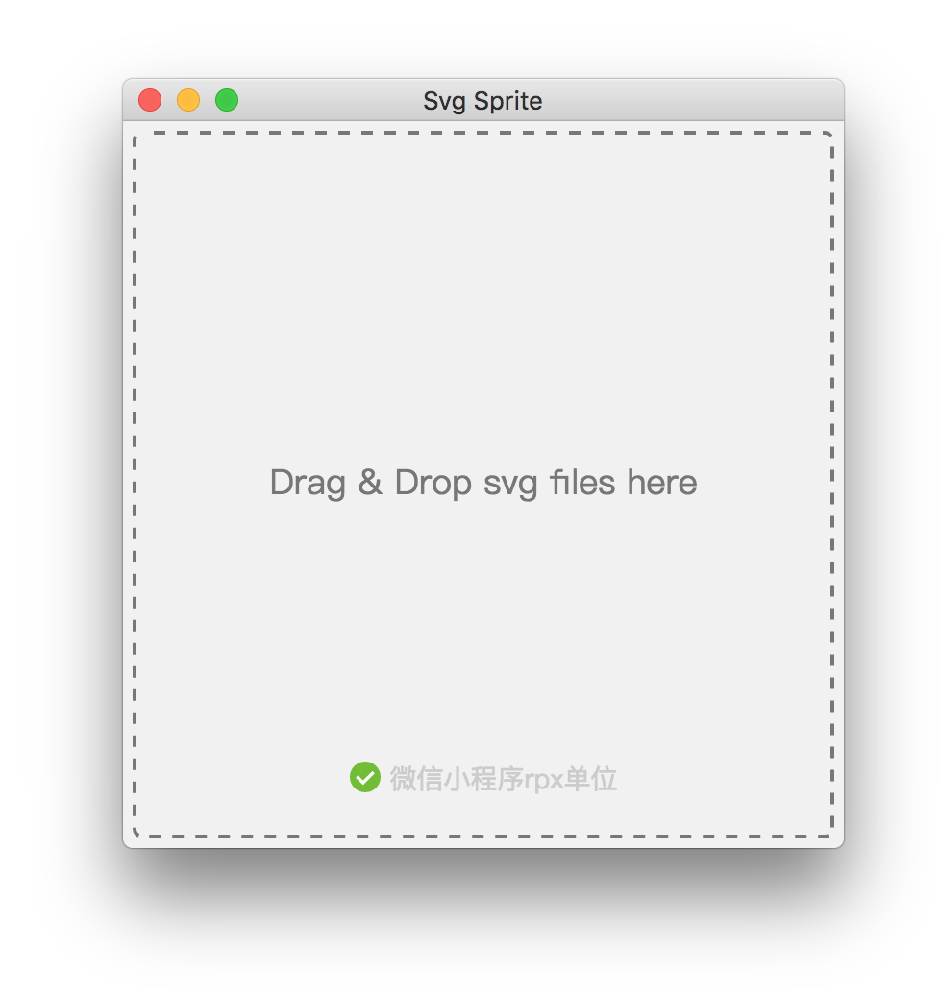

# SvgSprite

**自动生成svg雪碧图，支持微信小程序rpx单位**

## 安装使用
下载安装成功后，选中所要处理的svg图标拖拽到工具中即可自动转化，处理完成后将在本地同级目录生成一个sprite文件夹，里面包含合并的雪碧图以及样式

**界面预览**

## 下载
**暂时支持mac版**

[mac版](https://github.com/timezhong/SvgSprite/raw/master/SvgSprite-1.0.dmg)

